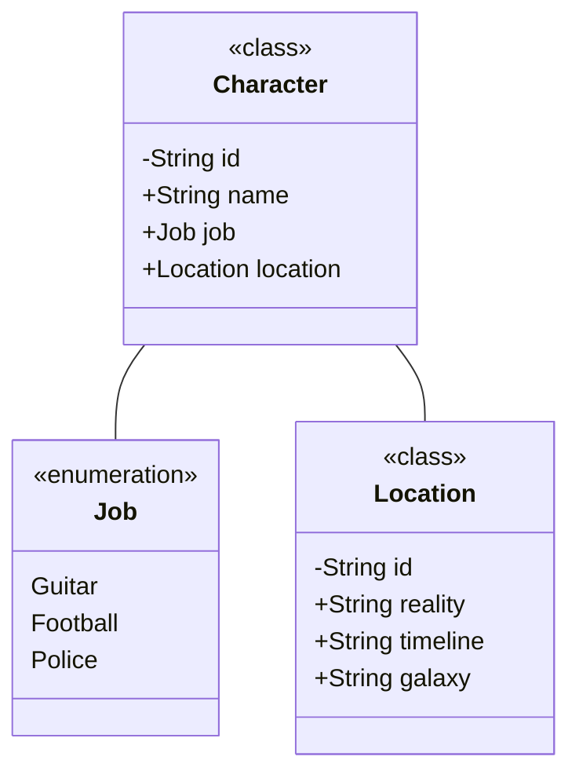

# Generacter

A somewhat clever random character or actor generator

## Class Diagram v1.0.0

```mermaid
 classDiagram
      class Character{
          <<class>>
          -String id
          +String name
          +Job job
          +Location location
      }
      class Job{
          <<enumeration>>
          Guitar
          Football
          Police
      }
      class Location{
          <<class>>
          -String id
          +String reality
          +String timeline
          +String galaxy
      }
      Character -- Job
      Character -- Location
```

